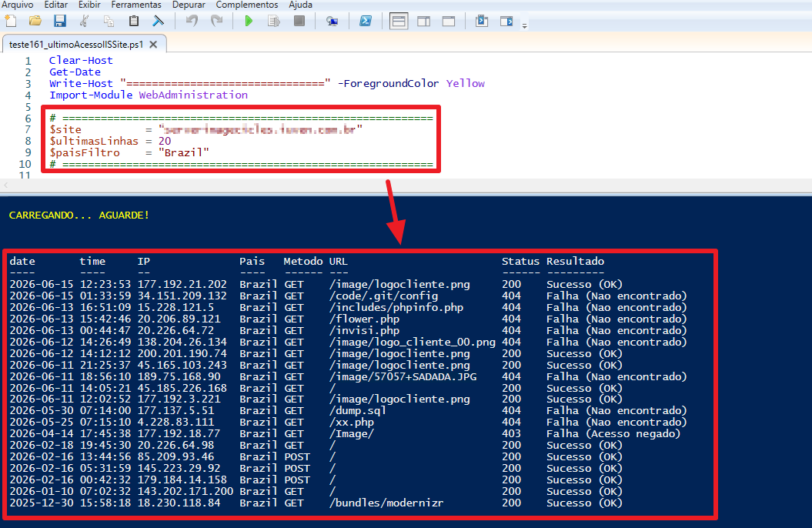

# Último Acesso IIS Site

Script PowerShell que analisa os **logs do IIS** de um site e mostra, de forma legível, os **últimos acessos únicos por IP**, incluindo o **país de origem** de cada visitante e a **descrição do status HTTP** da requisição.

Ideal para uma verificação rápida de "quem acessou o site recentemente", identificação de tentativas de acesso suspeitas (ex.: `404` em `/.git/config`, `/dump.sql`, `/xx.php`) e monitoramento de tráfego por país.

## Exemplo de execução



Na imagem: no topo estão os parâmetros configuráveis do script; embaixo, a tabela de saída com data, hora, IP, país, método HTTP, URL acessada, código de status e a descrição do resultado.

## O que o script faz

1. **Localiza automaticamente a pasta de logs** do site no IIS (via módulo `WebAdministration`), usando o ID do site (`W3SVC<id>`).
2. **Lê os arquivos de log do mais novo para o mais antigo** e percorre cada arquivo de baixo para cima, garantindo que as linhas mais recentes sejam processadas primeiro.
3. **Deduplica por IP** — cada IP aparece apenas uma vez, na sua ocorrência mais recente.
4. **Resolve o país de cada IP** consultando a API pública [ip-api.com](http://ip-api.com) em **lote** (até 100 IPs por requisição) e com **cache**, evitando uma chamada HTTP por IP.
5. **Filtra por país** (por padrão, `Brazil`) e coleta os acessos até atingir a quantidade de linhas configurada.
6. **Traduz o código HTTP** para uma descrição legível (ex.: `200 → Sucesso (OK)`, `404 → Falha (Nao encontrado)`, `403 → Falha (Acesso negado)`).
7. Exibe o resultado em uma **tabela formatada** com as colunas: `date`, `time`, `IP`, `Pais`, `Metodo`, `URL`, `Status`, `Resultado`.

## Configuração

Ajuste as variáveis no início do script ([teste161_ultimoAcessoIISSite.ps1](teste161_ultimoAcessoIISSite.ps1)):

```powershell
$site          = "serverimagecicles.iuven.com.br"   # nome do site no IIS
$ultimasLinhas = 20                                  # quantos acessos exibir
$paisFiltro    = "Brazil"                             # país a filtrar
```

## Pré-requisitos

- **Windows Server / Windows com IIS** instalado.
- Módulo **`WebAdministration`** disponível (instalado junto com as ferramentas de gerenciamento do IIS).
- **PowerShell 5.1** ou superior (o script é compatível com PS 5.1).
- **Permissão de leitura** na pasta de logs do IIS — execute preferencialmente como **Administrador**.
- **Acesso à internet** para a consulta de geolocalização em `ip-api.com`.

## Como executar

```powershell
# a partir da pasta do script, como Administrador
.\teste161_ultimoAcessoIISSite.ps1
```

## Observações

- A geolocalização usa a **API gratuita** do `ip-api.com`, que possui limite de requisições. Caso a consulta falhe ou expire, o IP é marcado como `Desconhecido`.
- O script lê apenas o necessário dos logs (do mais recente para o mais antigo), parando assim que atinge a quantidade de acessos configurada — o que o torna rápido mesmo com logs grandes.
